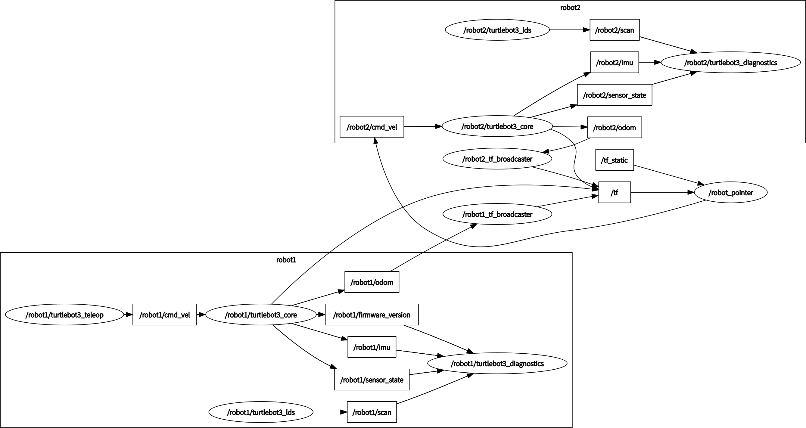

# item-机器人跟随demo

> @kdy

-----

## 一、item功能：键盘控制robot1，robot2根据robot1坐标跟随

1. 键盘控制robot1实现移动
2. robot1向tf发布自身姿态数据信息
3. robot2向tf发布自身姿态数据信息
4. robot1与robot2进行tf坐标转换，建立统一坐标系
5. 计算robot1与robot2坐标间的距离差与角度差，将该数据发布
6. robot2监听距离差与角度差，并控制自身移动

## 二、跟随过程

* 首先在item_tf.launch文件中建立两个节点，分别获取两个机器人的姿态数据信息（当前位置距离各自坐标系原点的位置和角度）
* 获取姿态数据信息后，通过tf坐标转换，分别将robot1和robot2的坐标变换到map坐标系下，向tf发布各自变换到map坐标系后的数据，此时就建立了以map坐标系为基准的统一坐标系统
* 然后在item_tf.launch文件中建立坐标监听节点，监听robot1和robot2的坐标，通过listener.lookupTransform()函数得到以robot2为原点的robot1的姿态信息(平移和旋转)

* 通过平移和旋转信息计算得到robot2要前往robot1坐标点 需要的线速度和角速度

* 将计算得到的线速度和角速度，将其发布到控制robot2运动的/robot2/cmd_vel topic上

  

## 三、运行方法

- 启动ROSCORE

``` sh
$ roscore
```

- 启动两个turtlebot3机器人：

``` sh
$ ROS_NAMESPACE=robot1 roslaunch turtlebot3_bringup turtlebot3_robot.launch multi_robot_name:="robot1" set_lidar_frame_id:="robot1/base_scan"
```

```sh
$ ROS_NAMESPACE=robot2 roslaunch turtlebot3_bringup turtlebot3_robot.launch multi_robot_name:="robot2" set_lidar_frame_id:="robot2/base_scan"
```

* 启动跟随launch文件

```sh
$ roslaunch item item_tf.launch
```

* 启动robot1键盘控制：

```sh
$ ROS_NAMESPACE=robot1 rosrun turtlebot3_teleop turtlebot3_teleop_key
```

----

* 同时也可以启动状态监视工具：

```sh
$ rosrun rqt_graph rqt_graph
$ rqt #调出TF Tree
```

